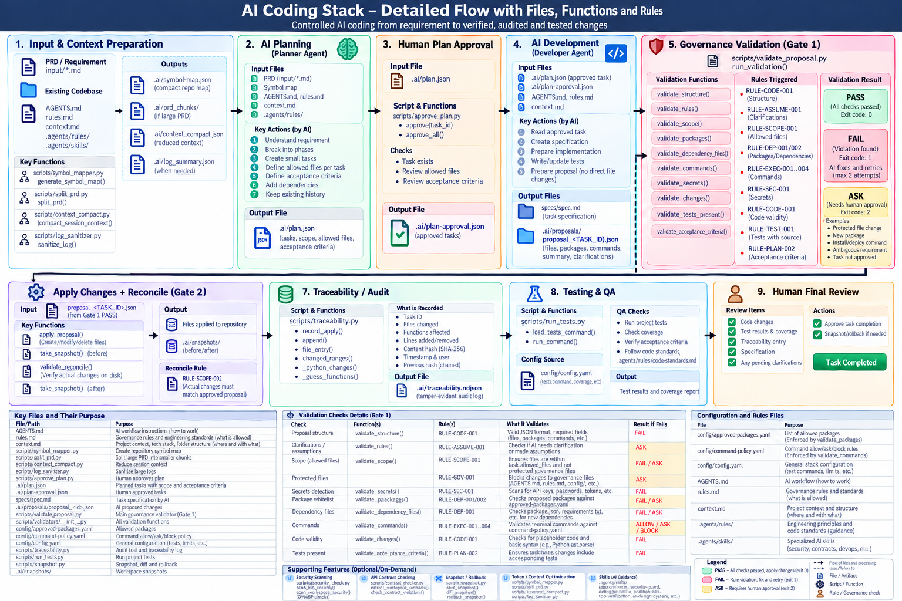

# Universal Multi-Agent AI Coding Stack & Vibe-Coding Guardrails

> A model- and IDE-agnostic AI pair-programming template: **The Four Principles**, a **PRD → plan → proposal → test** workflow with **human approval gates**, a **deterministic policy validator**, an **audit trail** of every applied change, **Git-free snapshots**, and **on-demand skills**.



---

## 🌐 Model & IDE Agnostic

- **Any AI model**: hosted or local. `.aistack/config/config.yaml` lists `ollama`, `bedrock`, `openai` and `fake` (tests only) as providers.
- **Any AI IDE / agent**: every tool reads the same rule card.

| Tool | Entry file |
| :--- | :--- |
| Claude Code | `CLAUDE.md` |
| Cursor | `.cursorrules` |
| Windsurf / Cascade | `.windsurfrules` |
| Cline / Roo-Code | `.clinerules` |
| Antigravity | `.agents/rules/`, `.agents/skills/` |
| Aider, OpenHands, plain terminal | `AGENTS.md` + the Python scripts |

---

## 🔄 How It Works

A requirement becomes a verified, audited, tested change in 9 stages. One AI plays the Planner and Developer roles; the gates, audit log and test run are done by code; humans approve the plan and the result. Full protocol: **[AGENTS.md](AGENTS.md)**.

| # | Stage | Who | Input → Output | Key script / functions |
| :-- | :--- | :--- | :--- | :--- |
| 1 | **Input & context preparation** | Human + AI | Files on disk → new/existing repo, source folders and test command in `context.md` (run once by a human); a chat request or a PRD in `input/*.md`; symbol map, PRD chunks (if too large) | `init_project.py`, `symbol_mapper.py`, `split_prd.py`, `context_compact.py`, `log_sanitizer.py` |
| 2 | **AI planning** | Planner Agent | Request or PRD → `.ai/plan.json`: phases, tasks, `allowed_files`, testable acceptance criteria, dependencies. A chat request becomes a one-task phase. New input appends phases; task IDs are never reused. | — |
| 3 | **Human plan approval** | Human | `.ai/plan.json` → `.ai/plan-approval.json`. Until a task is approved, or if its `allowed_files` later grows, the validator returns ASK (`RULE-PLAN-001`). | `approve_plan.py` (`approve()`, `approve_all()`) |
| 4 | **AI development** | Developer Agent | Approved task → `## TASK_ID` section in `.aistack/specs/spec.md` + `.ai/proposals/proposal_<TASK_ID>.json` (files, packages, commands, clarifications). Nothing is written to disk directly. | — |
| 5 | **Governance validation (Gate 1)** | Policy Agent (code) | Proposal → PASS / FAIL / ASK. Nothing is written unless every check passes. | `validate_proposal.py` → `validators/` |
| 6 | **Apply + reconcile (Gate 2)** | Policy Agent (code) | Hash the target files before, apply them, hash again after, then check disk matches the approved proposal (`RULE-SCOPE-002`). | `take_snapshot()`, `apply_proposal()`, `validate_reconcile()` |
| 7 | **Traceability / audit** | Code | One line per applied proposal in `.ai/traceability.ndjson`: task, files, added/removed lines, functions, content hashes, chained to the previous entry. | `traceability.py` (`--task`, `--file`, `--function`, `--check-drift`, `--verify-chain`) |
| 8 | **Testing & QA** | QA Agent (code) | `tests.command` from `.aistack/config/config.yaml` (+ optional lint row from `context.md`) → pass/fail counts; every acceptance criterion needs a test; coverage per `code-standards.md`. | `run_tests.py` |
| 9 | **Human final review** | Human | Code, test results, traceability entry, spec → approve (task `COMPLETED` in `.ai/plan.json`) or send remarks (back to stage 4). Roll back with `snapshot.py` if needed. | `snapshot.py rollback` |

### Gate 1 checks

| Check | Function | Rule | If it fails |
| :--- | :--- | :--- | :--- |
| Proposal structure | `validate_structure()` | `RULE-CODE-001` | FAIL |
| Clarifications / assumptions | `validate_rules()` | `RULE-ASSUME-001` | ASK |
| Scope (`allowed_files`) | `validate_scope()` | `RULE-SCOPE-001` | FAIL |
| Protected governance files | `validate_scope()` | `RULE-GOV-001` | ASK |
| Plan approved / not widened | — (in `validate_proposal.py`) | `RULE-PLAN-001` | ASK |
| Acceptance criteria present | `validate_acceptance_criteria()` | `RULE-PLAN-002` | FAIL |
| Package whitelist (imports) | `validate_packages()` | `RULE-DEP-001` / `002` | FAIL / ASK |
| Dependency manifests | `validate_dependency_files()` | `RULE-DEP-001` / `002` | FAIL / ASK |
| Commands | `validate_commands()` | `RULE-EXEC-001`…`004` | FAIL / ASK |
| Hardcoded secrets | `validate_secrets()` | `RULE-SEC-001` | FAIL |
| Code validity / placeholders | `validate_changes()` | `RULE-CODE-001` | FAIL |
| Tests included with source | `validate_tests_present()` | `RULE-TEST-001` | FAIL |
| Migrations & ORM auto-sync | `validate_database()` | `RULE-DB-001` / `002` | FAIL |

**Exit codes:** `0` PASS (applied) · `1` FAIL (AI fixes and retries) · `2` ASK (wait for a human) · `3` error (bad proposal or config). After `governance.max_repair_attempts` FAILs in a row on one task (currently 2), FAIL becomes ASK.

Rule IDs and the protected-file list live in **[rules.md](rules.md)**.

---

## 🚀 Quick Start

```bash
pip install pyyaml pytest
```

**Existing repo?** Copy `.aistack/`, `.ai/`, `.agents/`, `input/`, `AGENTS.md`, `rules.md`, `context.md`, `STACK_GUIDE.md` and your tool's rule card (e.g. `CLAUDE.md`) into its root. Nothing else is added, and none of your folders is touched.

Each step below is one stage of the flow above.

- **1. Input & context** — Run `python .aistack/scripts/init_project.py` once. It detects a new or existing repo, shows the source folders and test command it found (or asks 3 questions for a new project), and fills in `context.md` and `tests.command` after you confirm. For big work, drop a PRD into `input/` (example: `input/focus_game_prd.md`); if it is larger than `context.max_tokens`, run `python .aistack/scripts/split_prd.py input/<prd>.md`.
- **2. Planning** — Tell your AI what you want (*"Fix the 500 on login"*), or *"Phasify input/<prd>.md"* for a PRD. It writes `.ai/plan.json` (shape: `.ai/plan.example.json`).
- **3. Plan approval** — Review the plan, then run `python .aistack/scripts/approve_plan.py --all` yourself.
- **4. Development** — Tell your AI: *"Start TASK-001"*. It writes the spec section and the proposal.
- **5–7. Gate 1, Gate 2, audit** — The AI runs `python .aistack/scripts/validate_proposal.py .ai/proposals/proposal_TASK-001.json --apply`. On ASK (exit 2), it stops and waits for you.
- **8. Testing** — The AI runs `python .aistack/scripts/run_tests.py`.
- **9. Final review** — Check the changes, test results and `python .aistack/scripts/traceability.py --task TASK-001`, then approve or send remarks.

Prompt examples for every skill: **[STACK_GUIDE.md](STACK_GUIDE.md)**.

---

## 📖 Key Documentation

- 📘 **[STACK_GUIDE.md](STACK_GUIDE.md)**: Natural-language playbook — how to prompt the AI and when each skill activates.
- 📋 **[AGENTS.md](AGENTS.md)**: Step-by-step workflow and agent roles.
- 🔒 **[rules.md](rules.md)**: Validator rule IDs, protected files, structure, database and ambiguity rules.
- 📜 **[principles.md](.agents/rules/principles.md)**: The Four Principles (*Think Before Coding*, *Simplicity First*, *Surgical Changes*, *Goal-Driven Execution*).
- 🧱 **[code-standards.md](.agents/rules/code-standards.md)**: Typing, scoped logging, error handling, imports, config, testing, coverage, PRD traceability.
- 🗺️ **[context.md](context.md)**: Project context, folder conventions, build/run commands.
- ✅ **[.aistack/docs/live-model-test-checklist.md](.aistack/docs/live-model-test-checklist.md)**: Checklist for running a real model through the stack.

---

## 🧰 Progressive Skills Suite (`.agents/skills/`)

Markdown skills with YAML frontmatter, loaded **only when needed** to keep token costs low:

1. **`snapshot-rollback`**: Git-free local snapshots and one-command rollback in `.ai/snapshots/`.
2. **`podman-k8s-devops`**: Rootless Podman (`Containerfile`, `:Z` mounts), minimal multi-stage builds (`USER 10001`), Kubernetes manifests.
3. **`repo-symbol-map`**: AST symbol map giving whole-repo context in ~2KB (<500 tokens).
4. **`context-hygiene`**: Distills state into `.ai/session_summary.md` (<500 tokens) to reset a long chat without losing progress.
5. **`tdd-verification`**: Co-located tests, strict typing, scoped logging, automated test runs.
6. **`debugger-hotfix`**: 3-tier diagnosis (Structure → Config → Logic); reproduce bugs with a failing test first.
7. **`api-contracts`**: Schema-first models (Pydantic / TypeScript) and AST `@property` consistency checks.
8. **`ui-design-system`**: Dark mode, glassmorphism, responsive CSS (Flex/Grid), micro-animations.
9. **`owasp-security-guard`**: OWASP Top 10 hardening (parameterized queries, IDOR checks, bcrypt) and static secret scanning.

---

## ⚙️ Core Utilities (`scripts/`)

Plain Python; `validate_proposal.py`, `approve_plan.py` and `run_tests.py` need PyYAML. Listed in flow order.

| Stage | Script | Command | Purpose |
| :-- | :--- | :--- | :--- |
| 1 | **`init_project.py`** | `python .aistack/scripts/init_project.py [--yes]` | **Human only.** Detects a new or existing repo and fills in `context.md` and `tests.command`. |
| 1 | **`symbol_mapper.py`** | `python .aistack/scripts/symbol_mapper.py [--output <file>]` | AST symbol map of the repo (~2KB). |
| 1 | **`split_prd.py`** | `python .aistack/scripts/split_prd.py input/<prd>.md` | Splits an oversized PRD by `## ` section to fit `context.max_tokens`. |
| 1 | **`context_compact.py`** | `python .aistack/scripts/context_compact.py [--goal <goal>]` | Writes `.ai/session_summary.md`. |
| 1 | **`log_sanitizer.py`** | `python .aistack/scripts/log_sanitizer.py [<log>] [--max-chars N]` | Head/tail log trimmer to keep error output small. |
| 3 | **`approve_plan.py`** | `python .aistack/scripts/approve_plan.py [<TASK_ID>\|--all]` | **Human only.** Records approved `allowed_files` in `.ai/plan-approval.json`; needed again if a task's scope widens. |
| 5–6 | **`validate_proposal.py`** | `python .aistack/scripts/validate_proposal.py <proposal> --apply` | Deterministic policy gate (Gate 1) + apply and reconcile (Gate 2). |
| 7 | **`traceability.py`** | `python .aistack/scripts/traceability.py [--task\|--file\|--function] [--check-drift] [--verify-chain]` | Queries the audit log; detects files changed outside the proposal flow and broken hash-chain links. |
| 8 | **`run_tests.py`** | `python .aistack/scripts/run_tests.py` | Runs `tests.command` and the optional lint/type-check command; prints pass/fail counts. |
| 9 | **`snapshot.py`** | `python .aistack/scripts/snapshot.py [save [label]\|list\|diff\|rollback] [id]` | Git-free checkpoint, diff and rollback. |
| any | **`contract_checker.py`** | `python .aistack/scripts/contract_checker.py [--extract\|--check [file]]` | Records model contracts in `.ai/contracts.json` and flags drift (e.g. calling a `@property`). |
| any | **`security_check.py`** | `python .aistack/scripts/security_check.py [--path <dir>]` | Static secret and OWASP pattern scanner. |
| — | **`package_template.py`** | `python .aistack/scripts/package_template.py [--output <zip>]` | Zips a clean copy of the template (no caches, snapshots or project state). |

---

## 📁 Repository Structure

```
.
├── .agents/
│   ├── rules/                    # principles.md, code-standards.md
│   └── skills/                   # 9 on-demand skills
├── .ai/
│   ├── plan.example.json         # plan.json shape
│   ├── contracts.json            # contract_checker.py output
│   ├── proposals/                # proposal_<TASK_ID>.json envelopes
│   └── snapshots/                # snapshot.py checkpoints
│   # created at run time: plan.json, plan-approval.json, traceability.ndjson,
│   # task-state.json, session_summary.md
├── .aistack/                     # all stack tooling, out of the project's way
│   ├── config/
│   │   ├── config.yaml           # provider, tests.command, governance limits, snapshot excludes
│   │   ├── approved-packages.yaml  # package whitelist
│   │   └── command-policy.yaml   # allowed / blocked / approval-required commands
│   ├── docs/                     # live-model test checklist
│   ├── scripts/                  # tooling (validators/ holds the Gate 1 checks)
│   ├── specs/                    # spec.md (one running file) + _template.md
│   └── tests/                    # the stack's own unit & governance tests
├── input/                        # PRDs go here (optional: small work is asked in chat)
├── CLAUDE.md, .cursorrules, .windsurfrules, .clinerules   # per-IDE rule cards
├── AGENTS.md                     # workflow & roles
├── rules.md                      # enforced rules & protected files
├── context.md                    # project context & folder conventions
├── STACK_GUIDE.md                # natural-language playbook
└── README.md
```

---

## 🧪 Running the Stack's Own Tests

```bash
python -m pytest -q .aistack/tests
```

Once you set `tests.command` to your project's tests, use `python .aistack/scripts/run_tests.py` instead.
